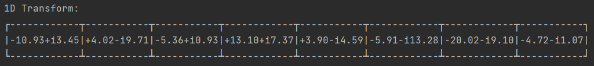
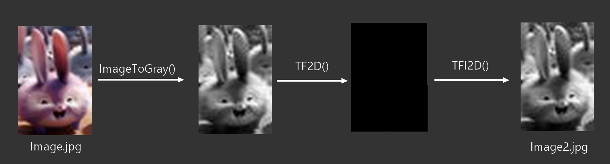

# FFT-Java - An Algorythm for Fast Fourier Transformation in Java language

In the main, there are several sections, they refer to the different possible treatments that we can do with the code.

## Initialization attributes:
Here are initialized the various tables and variables necessary for the proper functioning. We also see N and M which are respectively the first and second dimension of an array. 

It's necessary to leave this code block uncommented for the code to work.

## Table Filling:
This part allows you to fill the 1D and 2D tables with random values between -5 and +5 (ranMin and ranMax)

## Display of 1D transforms:
In this part, we can start to process the different 1D transforms by displaying them in tabular form. We can :
- Display the initial table
- Display the result of the 1D Transform
- Display the result of the Fast 1D Transform
- Display the result of the Reverse 1D Transform
- Display the result of the Fast 1D Reverse Transform

Exemple : 

## Calculation of the execution time:
This part allows to calculate the execution time :
- The 1D and fast transforms (size 2^14)
- 1D inverse and fast inverse transforms (size 2^14)
- The 2D transform (image size 40*59)
- The 2D inverse transform (image size 40*59)

And to calculate the execution time between :
- 1D and fast 1D
- 1D inverse and 1D fast inverse

## Image --> ArrayList<ArrayList<Complexe>> | TF2D(ArrayList) | TFI2D(ArrayList) --> Image2:
This part allows the processing of the image. Indeed, at the base of the project we can put an image called "image.jpg".
This one will then be processed:
1. Transformation of the color image into an image with shades of gray.
2. Transformation of the grayscale image to a complex array.
3. Processing the array with the 2D transform.
4. Return to the initial array with the inverse 2D transform.
5. We create the image "image2.jpg" result of the 2D inverse transform.
  

  
## Project members:

* **Loïs PAZOLA** - [@Mahtwo](https://github.com/Mahtwo)
* **Samuel LACHAUD** - [@samlach2222](https://github.com/samlach2222)
